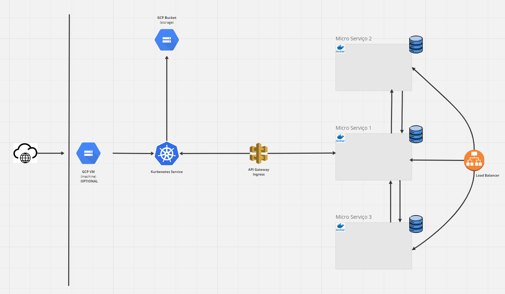

# README - Olist E-commerce Project in Cloud Computing

## Build and Execution Instructions

To compile and run the project, follow the instructions below:

### Build

- **Windows**: Execute the `deploy_ms.bat` file.
- **Linux**: Execute the `deploy_ms.sh` file.

### Stopping Containers

To stop the containers, execute the following files:

- **Windows**: `stop_ms.bat`
- **Linux**: `stop_ms.sh`

## Infrastructure Diagram

The infrastructure of the Olist E-commerce project is represented by the following diagram:

This diagram illustrates the cloud architecture used in the project, including the different components and how they communicate with each other.

## Swagger File

The Swagger file for the API of this project is available in the `swagger.yml` file. This file contains the API specification, including endpoints, parameters, and examples of requests.

## Authors:
[FCUL - Cloud Computing - Group 8]
- David Martins - fc62725
- José Augusto Oliveira - fc61009
- Jesse Araújo - fc60578